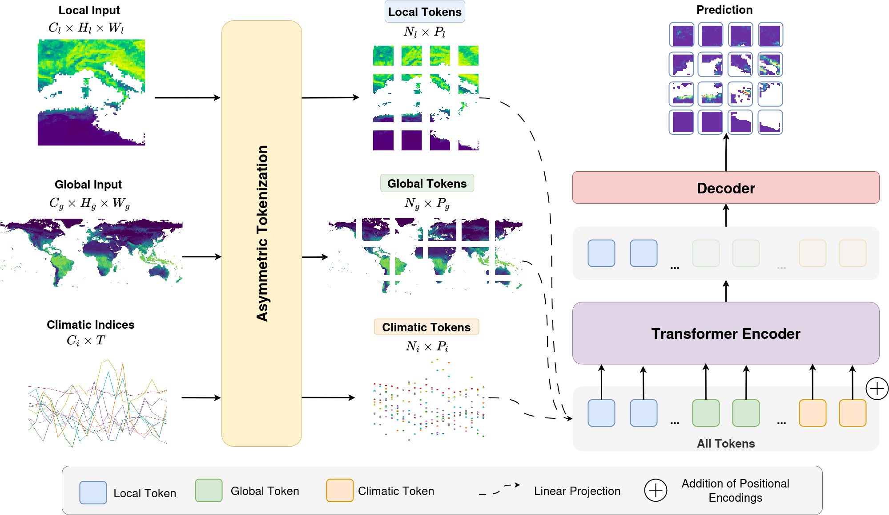

# TeleViT 1.0: Teleconnection-informed vision transformers for subseasonal to seasonal wildfire pattern forecasts

This is the repo for [Televit1.0]([https://arxiv.org/abs/2512.00089](https://iopscience.iop.org/article/10.1088/3049-4753/ae7088)), a continuation and more mature version of [TeleViT](https://github.com/orion-ai-lab/televit). 

The model fuses local inputs with coarsened global input and time-series of teleconnection indices to improve S2S forecasting. 

Visualizations of explainability and prediction maps can be found in this [HuggingFace application](https://huggingface.co/spaces/iprapas/televit-xai).



## Prerequisites

Before running the code, you need to install the requiremetns, download the data, preprocess them and create the .env file.

The code uses ashleve's pytorch lightning hydra template https://github.com/ashleve/lightning-hydra-template. It is worth reading the [template's README](./README_template.md) before trying to run the code.

### Install requirements

Tested with Python 3.10.

The repo uses uv for package management

```
# 1. Install uv
pip install uv # or follow the instructions for installing uv

# 2. Install the requirements 
uv sync

# 3. Activate the environemt
source ./venv/bin/activate
```

### Download the data

You have to download the [SeasFire dataset](https://zenodo.org/record/13834057) from zenodo. Note it is 44GB. 

You can use the download script - [./data/download_data.sh](./data/download_data.sh)

```
bash ./data/download_data.sh
```

The script will download the data in the data folder of the repo. You can modify the script accordingly to use your preferred location. 

Unzip the dataset to a folder of your choice. We will refer to the unzipped zarr as `DATASET_PATH` in the rest of the README.

### Create the coarsened dataset

See this [notebook](notebooks/create_coarsened_cube.ipynb) on how to create the coarsened dataset. This is necessary for the TeleViT experiments.

We will refer to the coarsened dataset as `DATASET_PATH_GLOBAL` in the rest of the README.

### Create a `.env` file

Needs wandb account. If you don't want to use wandb, you need to dig into the code to remove callbacks to wandblogger and/or use a different logger.

Create a `.env` file with the following variables:

```
WANDB_NAME_PREFIX="" # optional prefix for wandb runs
WANDB_ENTITY="" # your wandb entity
WANDB_PROJECT="" # your wandb project
DATASET_PATH="./data/seasfire_v0.4.zarr # path to the downloaded SeasFire dataset
DATASET_PATH_GLOBAL="./data/seasfire_1deg_v0.4.zarr" # path to the coarsened SeasFire dataset
```

## Running the experiments

To run the U-Net baseline:

```
bash scripts/unet_experiments.sh
```

To run the TeleViT experiments:

```
bash scripts/televit_experiments.sh
```

Running this is enough to reproduce the main results of the study and re-create all the models.

## Notes on undocumented capabilities

The code is made to do much more than what was documented in the publication:
- The model can be conditioned on time, following the methodology that was presented in MetNet-3 and the dataloader can work accordingly. I didn't manage to achieve a comparable performance to training inividually and thus left it out of the publication.
- Instead of learnable positional encodings for the transformer, one can pre-calculate local/global positional encodings (e.g. pre-calculated or even [satclip](https://github.com/microsoft/satclip) embeddings). The idea was that this way, the model could understand where in the Earth each token corresponds and associate it with the global input as well. Similarly, I didn't get a better performance (maybe slightly faster convergence) and therefore it was left out of the publication. 
- The models/dataloader has been adjusted for regression and regression in bins. 

To find all that you have to follow the different experiment configs in [./configs/experiment](./configs/experiment)

## Notes on Resources needed

- RAM memory: The code uses about 100GB of RAM to load the dataset into memory. This makes the process slow to start (waiting to preprocess the dataset and load it). However, it allows for the flexibility to change the ML dataset between runs, apply any kind of preprocessing, forecasting in different time horizons, adding/removing variables. If you set the dataset it would be better load samples from disk, creating a [WebDataset](https://github.com/webdataset/webdataset).

- GPU memory: The code has been tested with NVIDIA GPUs with at least 24GB RAM. For smaller GPUs, you might need to play with the datamodule.batch_size

## Citation

Currently under review, please cite the pre-print below:

```
@article{prapas2026televit,
  title={TeleViT 1.0: Teleconnection-informed vision transformers for subseasonal to seasonal wildfire pattern forecasts},
  author={Prapas, Ioannis and Papadopoulos, Nikolas and Bountos, Nikolaos Ioannis and Michail, Dimitrios and Camps-Valls, Gustau and Papoutsis, Ioannis},
  journal={Machine Learning: Earth},
  year={2026}
}
```
